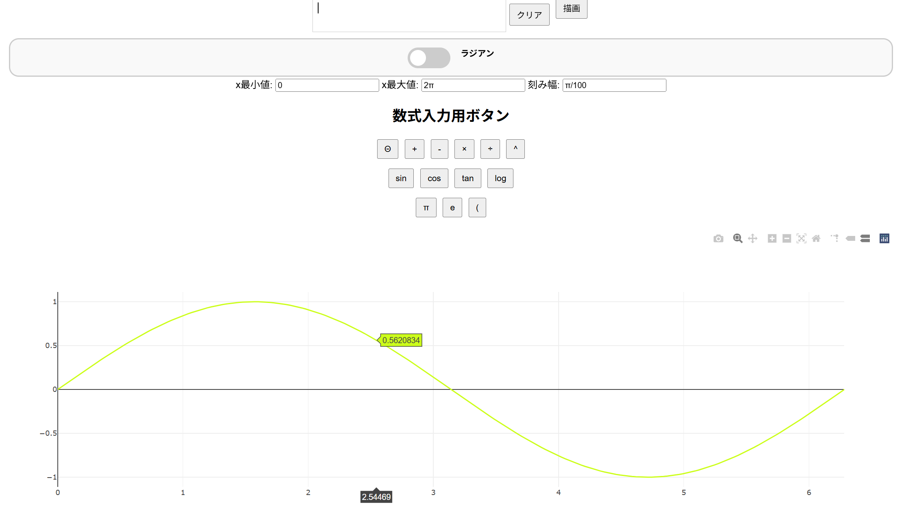

# Θ対応グラフ描画ツール

数学関数のグラフを簡単に描画できるWebツールです。  
特に角度変数 `Θ` に対応しており、度・ラジアン切替や特殊記号（π, eなど）の入力が可能です。  
さらに、数式入力欄には便利な関数・記号ボタンと「クリア」機能が付きます。

---

## 📌 デモスクリーンショット

---

## 主な機能

- **Θ（シータ）対応**：度・ラジアン切替が可能
- **関数ボタン**：sin, cos, tan, log 等
- **記号ボタン**：π, e, +, -, ×, ÷, ^
- **クリアボタン**：数式入力欄を即座にクリア
- **数式履歴**：過去の式を保存・再描画可能
- **自動掛け算補完**：数値×変数の掛け算を自動補完
- **カスタム範囲**：x軸の範囲と刻み幅を自由に指定可能

---

## 🚀 使い方

1. **数式入力欄に式を入力**  
   数値・変数（Θ, x, y）・記号・関数ボタンを組み合わせて式を作ります。  
   例：`sin(Θ)`, `x^2 + 3*x + 2`

2. **範囲設定**  
   x最小値、x最大値、刻み幅を入力します。  
   πなどの記号も使用可（例：`2π`, `π/4`）。

3. **角度切替**  
   「度／ラジアン」スイッチで Θ の扱いを切替。

4. **描画**  
   「描画」ボタンを押すと指定した式のグラフが描画されます。

5. **履歴管理**  
   過去の描画式は履歴に保存され、再描画や削除が可能。

6. **クリア機能**  
   数式入力欄右の「クリア」ボタンで入力欄をリセット。

---

## 📂 HTML構造

- `#equation`：数式入力欄（contenteditable）
- `#graph`：描画領域
- `#history`：描画履歴
- 各ボタン：数式・関数入力用

---

## 🎨 CSS構造

- `.btn-group`：入力ボタン群
- `.switch`：度／ラジアン切替スイッチ
- `#clear-btn`：クリアボタン

---

## ⚙ JavaScript構造

- `insertFunction(fnName)`：関数入力補完
- `insertVariable(varName)`：変数入力補完（Θに自動括弧判定）
- `insert(value)`：記号・数字挿入
- `clearEquation()`：数式欄クリア
- `addGraph()`：グラフ描画
- `addHistory(expr)`：履歴追加
- `reuseGraph(expr)`：履歴再描画
- `deleteHistory(btn)`：履歴削除
- `parseInputValue(value)`：入力値解析

---

## 🌐 動作環境

- モダンブラウザ（Chrome, Firefox, Edgeなど）
- インターネット接続（Plotly.js、Math.js CDN利用）

---

## 📜 ライセンス

MIT License  
自由に利用・改変可能です。

---

## 👤 作者

浦島 啓

---

## 📌 使用例

三角関数対応

